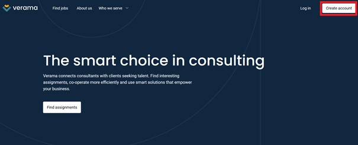

 

 

# Registering to Verama as a self-employed Java Developer
# The core value of the registration process
   
 
 
 
 

 Michał Kolasiński 

 Technical Writer/ Technical Translator 

 
 
 
 
 
 
 
 
 
 

# Table of Contents

 
 
 

1. [Registering to Verama as a self-employed Java Developer](#manual)
2. [Registering to Verama as a self-employed Java Developer](#core)

 
 

**What is the goal of this document?**

This document provides guidelines regarding the registration process at https://www.verama.com/en/. Note, that this manual is for self-employed Java Developers.

**Important!**

For the purpose of this document, this registration process was carried out on Mozilla and Chrome Browsers (on a PC computer), and on a mobile device (with Android system). The process did not differ significantly between these browsers, and devices.
However, the registration process was not carried out on iPhone or any other device with iOS system.

------

## <a name="manual"><b>1. Registering to Verama as a self-employed Java Developer </b></a>

1.	Go to https://www.verama.com/en/ on your favorite Web Browser. A screen will appear, as shown below.

 

2.	To create an account on Verama, click the **Create Account**  button in the upper-right corner of the screen. A screen will appear, as shown below.

 

3.	Fill out all the fields, read the privacy policy, and accept it. In case some fields are left blank, or filled out incorrectly, the website will ask you to fill out/correct the data in a particular field.

***Note***: It is impossible to proceed without accepting the privacy policy and user access agreement.
 
4.	Click the **Create Account**  button to proceed further. The following screen should appear.
 
 

 

5.	The website will now ask you to read the verification e-mail. Go to your mailbox, and read a message with a title **„Verify e-mail and complete registration”**. The message will contain the following screen.

*Note: In case you don’t receive the message, check the Spam folder, or click the **Resend email**  for the verification e-mail to be sent again.
 

 

6.	Click the **Verify email"" button . If the verification is successful, a screen will appear, as shown below.
 
 

 
7.	Your account has now been created. Click the **Log in**  button to log in to your account. The following screen should appear.
 
 

 
8.	Now, enter the email/login, and the password that you provided during the registration process. Then, click the **Log in**  button. If the data provided are correct, the following screen should appear.
 

 
 

9.	Select your country from the list, and then enter your VAT number. Then, click the **next**  button. You will be asked to provide more information, as shown below.

***Note***: VAT number is the number your are assigned to when registering a business activity (company).
 

 
 

 
 

10.	The website will now ask you to provide more information regarding your company. Fill out all the fields. 

***Note***: From the “Company size” list, select “1 – self-employed”.

11.	Then, click the **Add Company** button to enter your platform. A screen similar to the screen below should appear.
 

 
 
